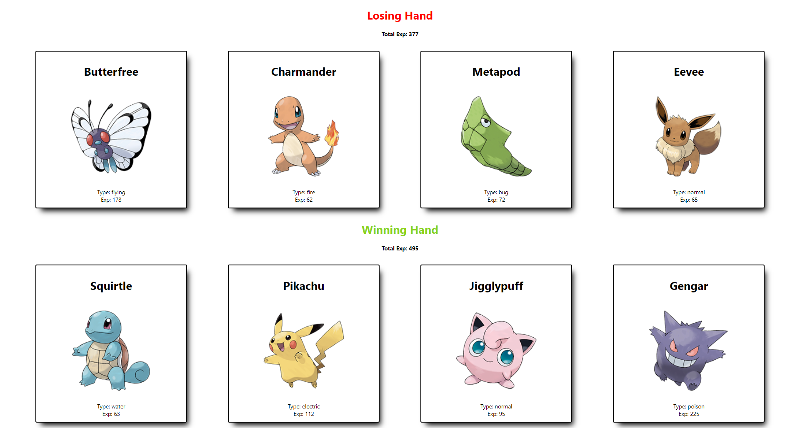

# Pokedex Exercise

## Description
Pokedex Exercise is a React site that allows for a random hands game using pokemon. It will show 4 random pokemon cards per hand, total up the experience based on the pokedex of the pokemon given, and tell which winner is between the two hands. This was written using React along with the images gathered from an API.

## Credit
This exercise was provided by Colt Steel within his Udemy course, Modern React Bootcamp.